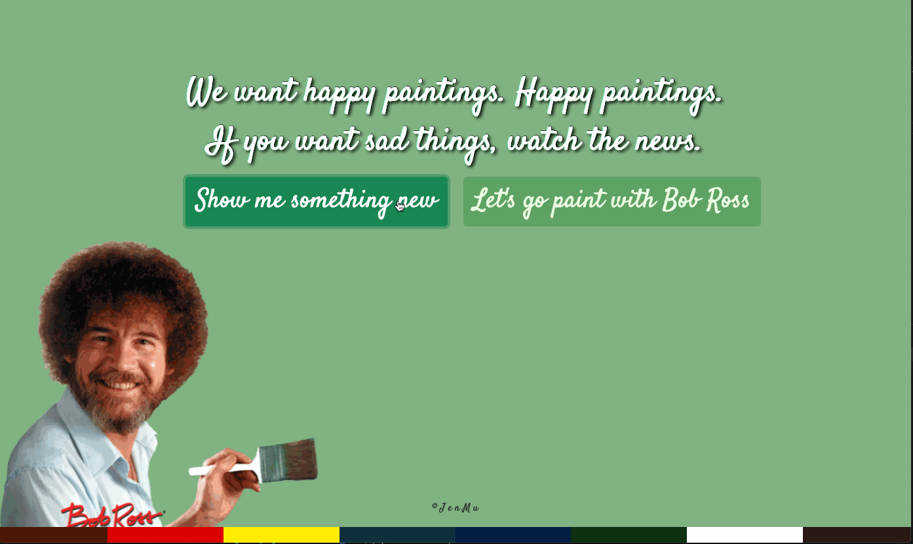
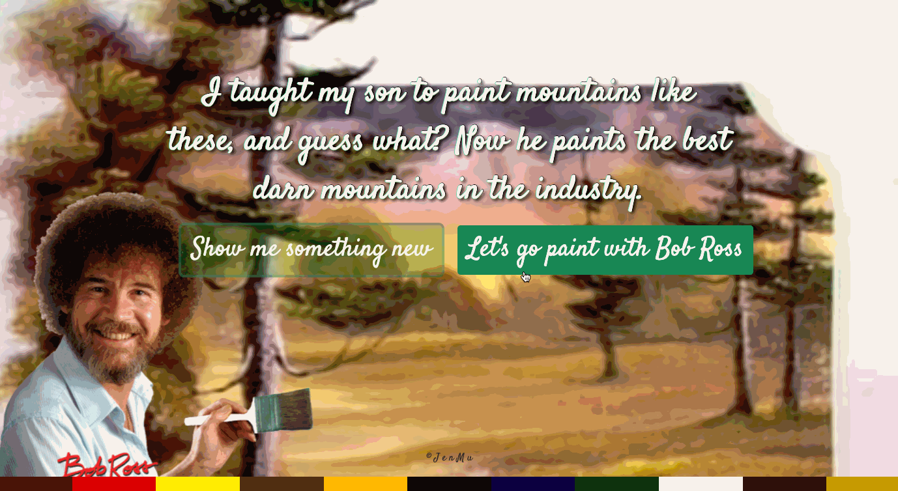
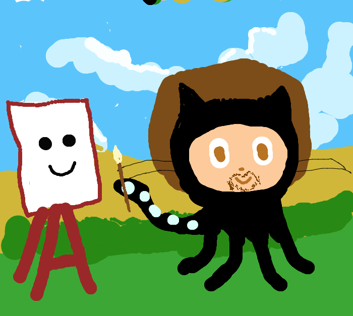
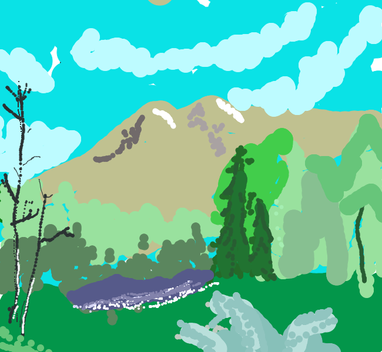
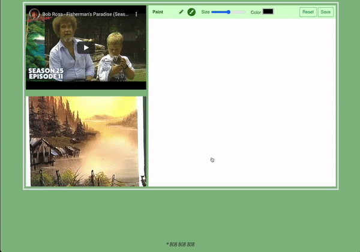

## Words on Canvas (Bob Ross Inspired)
[](https://github.com/tterb/atomic-design-ui/blob/master/LICENSEs)
[](https://pypi.python.org/pypi/yt2mp3/)
[]()
[](https://github.com/sindresorhus/awesome)

## Table of Contents
1. [Overview](#overview)
2. [Technologies](#technologies)
3. [Installation](#installation)
4. [Roadmap](#roadmap)
5. [FAQs](#faqs)

### ***See the world through Bob Ross's words and art*** 

### HackOn2.0 Theme: Open Innovation

### Overview
<a name="Overview"></a>
We are presenting a full stack web application that allow any users to explore the quotes from Bob Ross and paint on a canvas with a video tutorial. Painting is a creative hobby that comes with numerous mental health benefits like relieving stress, expands creativity, and cultivates emotional growth. And a key icon in the world of painting is Bob Ross. Back in the 90s, we all got to enjoy episodes of his show: The Joy of Painting. Even though, Bob Ross is not with us today, his passion and guidance in painting are still an inspiration for others to paint.  So, this app is built to honor his work and share some of his best ideas via technology. We hope to provide a safe haven to destress and put our imaginations at work. 
<br>
<br>

#### Video Demo: <br> 

https://www.youtube.com/watch?v=z0__LwXnono
<br>
<br>
<br>

***Meet Bob Ross and read his best quotes. A new painting will show for every re-quote. Footer will also change colors based on the painting.***
<br>


<br>

***Once a user know what to paint and click Let's Paint, they will be guided to the next page***
<br>

<br>

***Ocotocat Tax***
<br>

<br>
<br>

<br>

***Here are some favorites!***
<br>
By Muna:<br>
<br>

<br>



### Technologies
<a name="Technologies"></a>
- Backend: Python, SQLAlchemy, PostgreSQL, Pandas, Flask, Jinja2,
- Frontend: Javascript, jQuery(AJAX), Bootstrap, Google Fonts, HTML5, CSS3
- Special thanks to: jwilber for the awesome Bob Ross compilation


### Installation
<a name="installation"></a>

Clone or fork repository:
```
$ git clone https://github.com/JeeheeHan/jenmu-bob-ross.git
```
cd into the file and build the virtual environment:
```
$ virtualenv env
$ source env/bin/activate
```

Create a secrets.sh file and use your own postgresl uri or use this sample one:
```
$ touch secrets.sh
$ echo 'export DATABASE_URL='postgresql:///bob_ross' > secrets.sh
```
Install dependencies:
```
$ pip3 install -r requirements.txt
```
Create the DB and add the image routes to seed data:
```
$ createdb bob_ross
$ python3 seed.py
```
Time to meet Bob Ross!!
```
$ python3 server.py
```

### Roadmap
<a name="Roadmap"></a>
- User logins to store indivdual work
- Share to other Social Media handles

### FAQs
<a name="faqs"></a>
This project is our first Hackathon Project! Can we just say, we are pretty great and had so much fun making this

Find Jenny on [LinkedIn](https://www.linkedin.com/in/jihee-jenny/) and on [Github](https://github.com/JeeheeHan) <br>
Find Muna on [LinkedIn](https://www.linkedin.com/in/mainiwaer/) and on [Github](https://github.com/mainiwaer)

